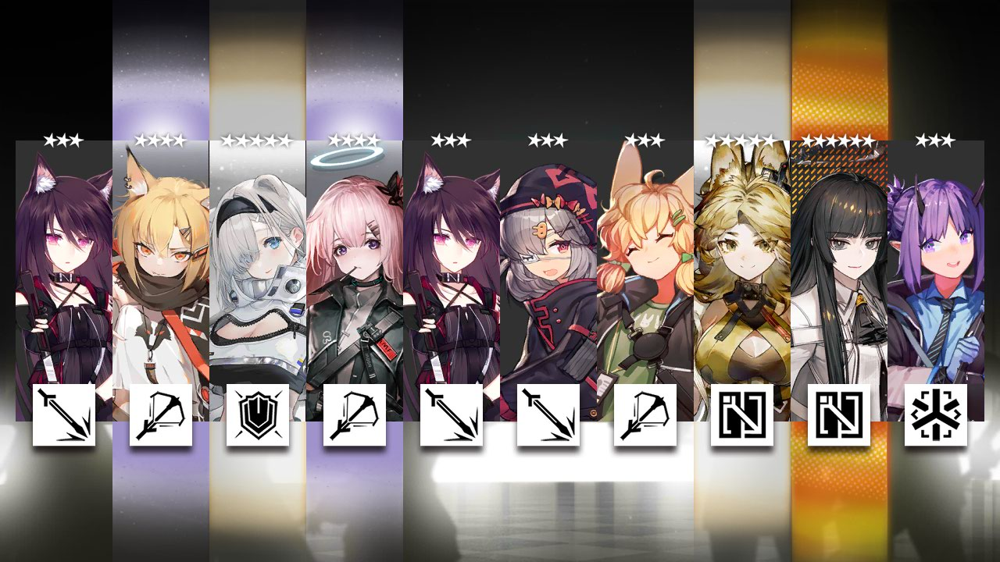

<div align="center">

# Arknights Kit

[](https://github.com/psf/black)
[](https://pycqa.github.io/isort/)
[](https://github.com/RF-Tar-Railt/arknights-kit/blob/master/LICENSE)
[](https://pdm.fming.dev)
[](https://img.shields.io/pypi/v/arknights-kit)

</div>

明日方舟(Arknights) 相关功能的整合库

现拥有如下功能：

- 抽卡
- 模拟十连
- 随机干员生成
- 公招链接生成

## 安装

```shell
pip install arknights-kit
```

```shell
pdm add arknights-kit
```

## 示例

```python
from arknights_kit import ArknightsGacha, GachaUser, simulate_image
from pathlib import Path
import asyncio


async def main():
    gacha = ArknightsGacha()
    user = GachaUser()
    data = gacha.gacha(user, 10)
    img = await simulate_image(data[0])
    with Path("example_sim.png").open("wb+") as f:
        f.write(img)

asyncio.run(main())
```

抽卡结果:

